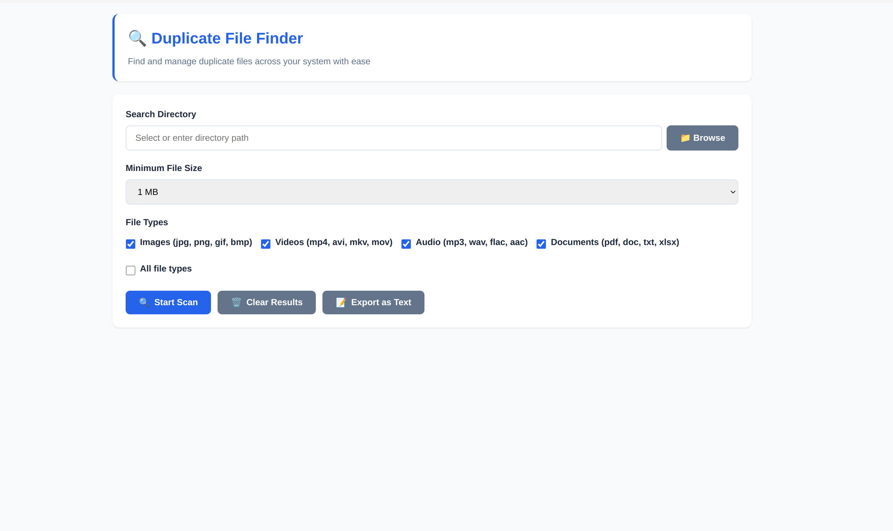

<div style="text-align: center;">
    
</div>


# Duplicate File Finder

A fast, cross-platform desktop application built with Electron for detecting and managing duplicate files using content-based comparison. Unlike basic duplicate checkers that rely on filenames, this application compares actual file contents to ensure accurate and reliable results.

## Features

### Duplicate Detection Engine

- Content-based file comparison (not filename matching)

- Accurate detection even if files are renamed

- Efficient scanning for large directories

- Optimized hashing workflow for performance

### File Management

- Duplicate files grouped clearly

- Batch selection and deletion

- Safe removal workflow

- Scan entire directories or specific paths

### Cross-Platform Desktop App

- Windows installer (`.exe`)

- macOS disk image (`.dmg`)

- Linux AppImage (`.AppImage`)

- Modern desktop UI powered by Electron


## Installation

### Prerequisites

- Node.js (LTS recommended)

- npm or yarn


### Build From Source

```
git clone https://github.com/macbuildssys/duplicate-file-finder.git

cd duplicate-file-finder

npm install

npm start
```

## Production Builds

### Build for Current Platform

```
npm run dist
```

### Build for Specific Platforms

```
npm run dist:linux    # Creates AppImage

npm run dist:win      # Creates Windows installer (.exe)

npm run dist:mac      # Creates macOS DMG (.dmg)
```

Compiled packages will be available in the `dist/` directory.

## Linux (AppImage)

### Run

```
chmod +x Duplicate-File-Finder-1.0.0.AppImage

./Duplicate-File-Finder-1.0.0.AppImage
```

### Common Linux Issues

#### Missing FUSE Library

If you see:

```
dlopen(): error loading libfuse.so.2
```

Install FUSE:

```
# Ubuntu/Debian

sudo apt install libfuse2

# Fedora/CentOS/RHEL

sudo dnf install fuse-libs

# Arch Linux

sudo pacman -S fuse2
```

#### SUID Sandbox Error

If you encounter:

```
FATAL:setuid_sandbox_host.cc: The SUID sandbox helper binary was found, but is not configured correctly.
```

Temporary workaround:

```
./Duplicate-File-Finder-1.0.0.AppImage --no-sandbox
```

## Proper fix:

```
./Duplicate-File-Finder-1.0.0.AppImage --appimage-extract

sudo chown root:root squashfs-root/chrome-sandbox

sudo chmod 4755 squashfs-root/chrome-sandbox

./squashfs-root/AppRun
```

## Development

Run in development mode:

```
npm start
```

## Build for production:

```
npm run build
```

## Roadmap

- Improve scanning performance for very large datasets
- Add file preview functionality
- Add exclusion filters (by extension, size, directory)
- Future core rewrite in Rust for improved memory safety and speed

## Contributing

Contributions are welcome.

1. Fork the repository
2. Create a feature branch
3. Commit your changes
4. Open a Pull Request


## License

Distributed under the MIT License. See [LICENSE](LICENSE).